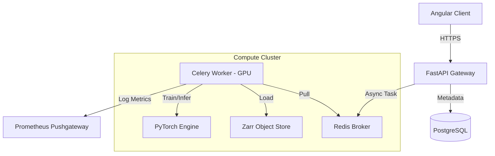

# Promethium Framework: State-of-the-Art Seismic Data Reconstruction

[](https://github.com/olaflaitinen/Promethium/actions/workflows/ci.yml)
[](https://creativecommons.org/licenses/by-nc/4.0/)
[](https://www.python.org/downloads/)
[](https://pytorch.org/)
[](https://angular.io/)
[](https://github.com/astral-sh/ruff)


## Abstract

**Promethium** is an open-source, high-performance computational framework dedicated to the reconstruction, denoising, and regularized interpolation of seismic wavefields. Addressing the ill-posed inverse problems inherent in sparse seismic acquisition, Promethium synergizes classical geophysical signal processing with modern deep generative models. The system introduces a hybrid architecture where Physics-Informed Neural Networks (PINNs) regularize data-driven priors (U-Net, Autoencoders) via the acoustic wave equation, ensuring that reconstructed traces adhere to governing physical laws. Engineered for scalability, the framework leverages a microservices-based topology (FastAPI, Celery, Redis) and optimized Cloud-Native storage (Zarr) to process terabyte-scale datasets on distributed GPU clusters.

## 1. Introduction

Seismic data processing is fundamental to subsurface imaging in exploration geophysics, seismology, and hazard analysis. However, field data is frequently compromised by environmental noise, irregular sampling geometries, and missing traces due to access constraints or equipment failure.

Promethium addresses these challenges by treating seismic reconstruction as a structured inpainting problem $y = M \cdot x + \epsilon$, where $y$ is the observed data, $M$ is the subsampling mask, and $\epsilon$ is noise. The framework solves for the ideal wavefield $x$ by minimizing a composite objective function:

$$ \mathcal{L}_{total} = || M \cdot f_\theta(y) - y ||_2^2 + \lambda_{phys} || \mathcal{W}(f_\theta(y)) ||_F^2 $$

Where $f_\theta$ is the deep neural network and $\mathcal{W}$ is the wave equation operator. This approach yields reconstructions that are both data-consistent and physically plausible.

## 2. Methodology & Algorithms

Promethium implements a rigorous suite of algorithms tailored for differing data regimes.

### 2.1 Deep Generative Models

*   **Residual U-Net**: A modified U-Net architecture featuring ResNet blocks in the encoder/decoder paths to mitigate vanishing gradients during deep feature extraction. It utilizes Attention Gates at skip connections to suppress irrelevant regions in the feature maps, focusing computational capacity on detailed wavefront structures.
*   **Denoising Autoencoders**: Deep Convolutional Autoencoders (DCAE) trained to map noisy inputs to a clean latent manifold. The bottleneck layer enforces a compact representation, effectively filtering out incoherent noise that lacks structural support.

### 2.2 Physics-Informed Neural Networks (PINNs)

To prevent the "hallucination" of geologically physically invalid events, Promethium incorporates soft physical constraints.
*   **Wave Equation Loss**: Penalizes deviations from the scalar acoustic wave equation $\nabla^2 u - \frac{1}{c^2} \frac{\partial^2 u}{\partial t^2} = 0$.
*   **Implementation**: Finite-difference stencils are differentiated automatically via PyTorch's autograd engine to compute partial derivatives $\partial u / \partial x$ and $\partial u / \partial t$ during training.

### 2.3 Data Engineering Pipeline

Traditional SEG-Y formats, optimized for sequential tape access, introduce significant I/O latency in random-access ML workflows.
*   **Ingestion**: A scalable ETL pipeline converts SEG-Y volumes into **Zarr** archives.
*   **Zarr Storage**: Data is chunked into N-dimensional blocks (e.g., `(Time: 128, Offset: 128)`) and compressed with Blosc. This enables random access to local patches in $O(1)$ time, saturating GPU bandwidth during training without IO blocking.

## 3. System Architecture

The technical architecture adheres to the **Twelve-Factor App** methodology, ensuring portability and scalability.



### 3.1 Component Stack
*   **Frontend**: Angular 17 SPA with D3.js/WebGL for high-density seismic visualization. Features include real-time gain adjustment, spectral analysis, and side-by-side difference plotting.
*   **Backend**: Python 3.10 / FastAPI. Fully typed codebase complying with OpenAPI 3.1 standards.
*   **Orchestration**: Celery workers handle long-running jobs (training, inference). State is managed via Redis Sentinel for high availability.
*   **Persistence**: PostgreSQL for relational metadata (Project/Dataset/Job hierarchy); Zarr on local NVMe or S3 for bulk data.

## 4. Performance & Benchmarking

Promethium includes `src.promethium.ml.benchmark.BenchmarkEngine` to enforce rigorous quantitative standards.

### 4.1 Metrics
*   **SSIM (Structural Similarity Index)**: Measures the degradation of structural information (luminance, contrast, structure) rather than pixel-wise errors. Critical for assessing reflector continuity.
*   **PSNR (Peak Signal-to-Noise Ratio)**: Standard engineering metric for reconstruction fidelity.
*   **SNR**: Signal-to-Noise ratio in decibels (dB).

### 4.2 Computational Efficiency
*   **Batching Strategy**: Data loaders utilize dynamic patch extraction with pre-fetching to maintain 100% GPU volatile utility.
*   **Inference**: Implements a sliding-window approach with Cosine blending to eliminate block artifacts at patch boundaries, ensuring seamless full-volume reconstruction.

## 5. Deployment Guide

The platform is containerized for deployment on Kubernetes or Docker Swarm.

### Prerequisites
*   **OS**: Linux (Ubuntu 22.04 LTS recommended)
*   **Container Runtime**: Docker Engine 24.0+
*   **Hardware**: NVIDIA GPU (Ampere/Hopper architecture) with Container Toolkit installed.

### Installation

1.  **Clone Repository**:
    ```bash
    git clone https://github.com/olaflaitinen/Promethium.git
    cd Promethium
    ```

2.  **Environment Setup**:
    Configure environment variables for database credentials and storage paths.
    ```bash
    cp .env.example .env
    ```

3.  **Build & Launch**:
    Execute the multi-stage Docker build process.
    ```bash
    docker-compose up --build -d
    ```

4.  **Verification**:
    *   **Frontend**: `http://localhost:4200`
    *   **API Specs**: `http://localhost:8000/docs`
    *   **Grafana**: `http://localhost:3000`

## 6. Usage Workflows

### 6.1 Data Ingestion
Users upload SEG-Y files via the Angular Dashboard. The backend triggers an asynchronous indexing task, extracting binary headers and geometry metadata to populate the PostgreSQL catalog, while simultaneously transcoding trace data to Zarr.

### 6.2 Model Training
Researchers configure experiments via the UI, selecting:
*   **Architecture**: U-Net Depth, Filter counts, Activation functions.
*   **Loss Function**: Weighted combination of MSE, L1, and Physics constraints.
*   **Hyperparameters**: Learning rate schedules (Cosine Annealing), Batch size.

### 6.3 Inference & QC
Trained models are stored in the Model Registry. Operations can be applied to new surveys. Results are visualized in the "Quality Control" module, overlaying the residual difference map to highlight reconstructed energy.

## 7. Governance & Citation

### Governance
Promethium is maintained by a core team of geophysicists and research engineers. decision-making follows a consensus-seeking model detailed in `GOVERNANCE.md`.

### Citation
If you use Promethium in academic research, please cite:

```bibtex
@software{promethium_framework,
  author = {Promethium Contributors},
  title = {Promethium: Advanced Seismic Data Recovery Framework},
  year = {2025},
  url = {https://github.com/olaflaitinen/Promethium},
  license = {CC BY-NC 4.0}
}
```

## 8. License

**Promethium** is licensed under the **Creative Commons Attribution-NonCommercial 4.0 International (CC BY-NC 4.0)** license.
*   **Academic/Research Use**: Permitted and encouraged.
*   **Commercial Use**: Strictly prohibited without a commercial license agreement.

For full legal terms, consult the [`LICENSE`](LICENSE) file.
