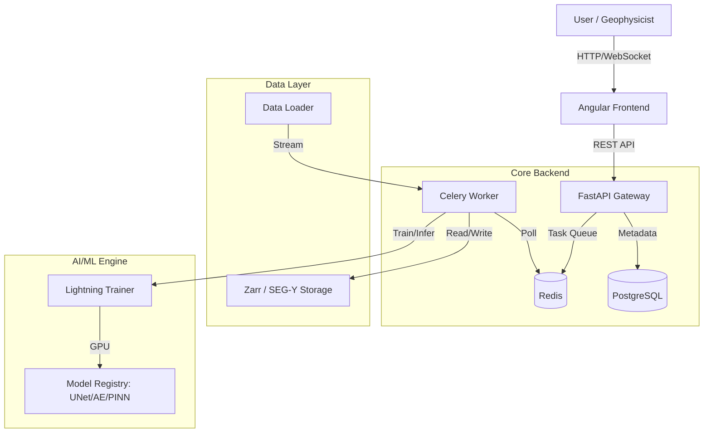

# System Architecture 🏛️

Promethium follows a modern, microservice-inspired modular monolith architecture designed for scalability and separation of concerns.

## High-Level Overview

## detailed Components

### 1. Frontend (`frontend/`)
*   **Framework**: Angular 17+
*   **Design System**: "Void/Neon" (Dark Navy `#050B24`, Cyan `#00F0FF`).
*   **Responsibilities**: 
    *   Job Configuration (Wizard style).
    *   Real-time status monitoring via polling/SSE.
    *   Interactive Visualization (Canvas/WebGL) of seismic traces.

### 2. Backend API (`src/promethium/api/`)
*   **Framework**: FastAPI
*   **Responsibilities**:
    *   RESTful endpoints for Datasets, Models, and Jobs.
    *   Pydantic schema validation (`schemas.py`).
    *   Authentication and Role Management.

### 3. Workflow Engine (`src/promethium/workflows/`)
*   **Framework**: Celery
*   **Broker**: Redis
*   **Responsibilities**:
    *   Asynchronous execution of long-running tasks.
    *   Task routing (e.g., `gpu` queue vs `cpu` queue).
    *   Status updates back to Redis/DB.

### 4. ML Core (`src/promethium/ml/`)
*   **Framework**: PyTorch & PyTorch Lightning.
*   **Key Modules**:
    *   `models/`: Registry of architectures (`UNet`, `Autoencoder`).
    *   `data/`: `SeismicDataset` wrapping `xarray` for efficient patching.
    *   `train.py`: Standardized `LightningModule` for training loops.
    *   `inference.py`: Sliding-window inference with cosine blending.
    *   `benchmark.py`: Calculation of SSIM, PSNR, SNR.

### 5. Data Persistence
*   **Metadata**: PostgreSQL (Datasets, Job History, User Profiles).
*   **Seismic Data**: 
    *   Raw: SEG-Y (Standard Industry Format).
    *   Optimized: Zarr (Chunked, Compressed, Cloud-Native).
