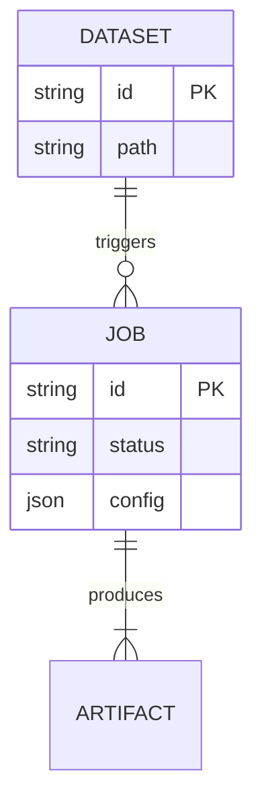

# Data Models

## Conceptual Schema

### Dataset
Represents a raw seismic survey.
*   `id`: UUID
*   `name`: Human-readable name.
*   `file_path`: Location of source file.
*   `metadata`: JSON blob containing geometry (sample rate, trace count).

### Job
Represents a unit of work (Training or Inference).
*   `id`: UUID
*   `type`: `TRAINING` | `INFERENCE`
*   `status`: `QUEUED` | `RUNNING` | `COMPLETED` | `FAILED`
*   `config`: Full configuration used to launch the job.
*   `dataset_id`: Foreign Key to Dataset.
*   `result_path`: Location of output artifacts.

### ModelArtifact
Represents a trained model checkpoint.
*   `id`: UUID
*   `family`: Model architecture family.
*   `path`: Location of `.pt` weights file.
*   `metrics`: JSON blob of benchmark results (val_loss, ssim).

## E-R Diagram (Simplified)

